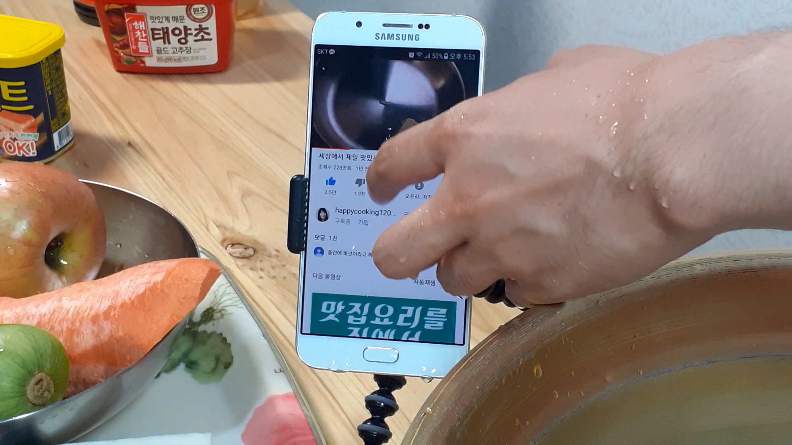
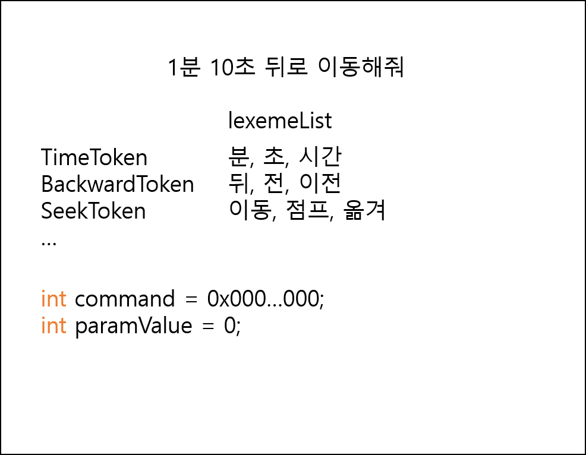
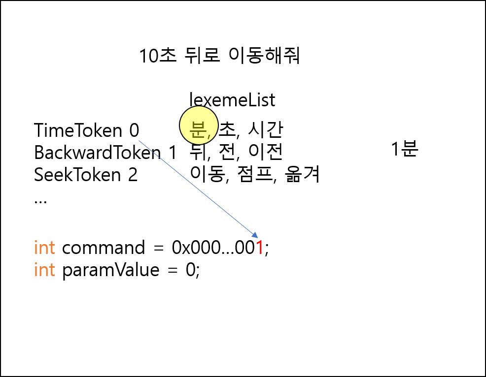
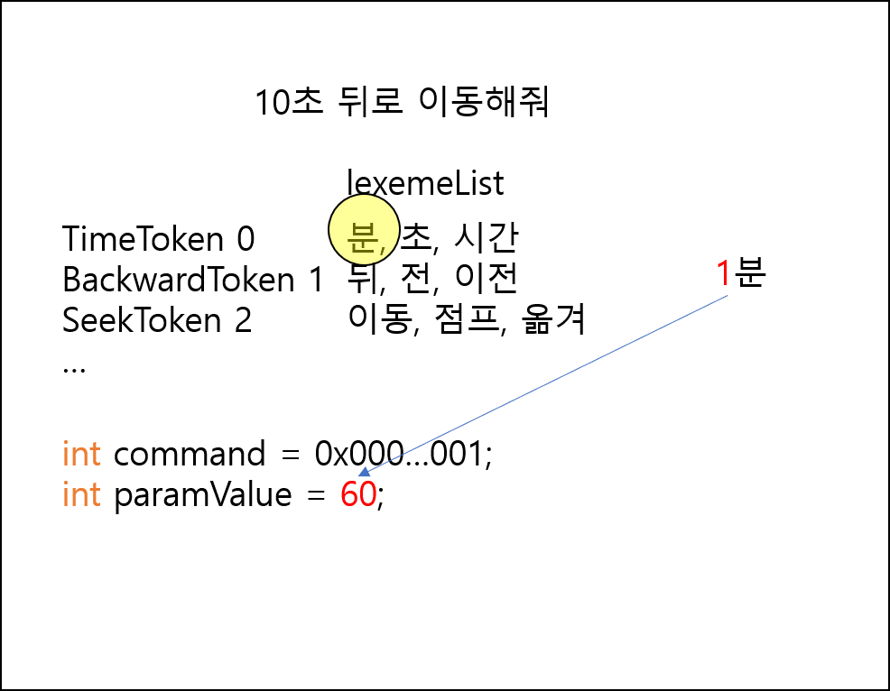
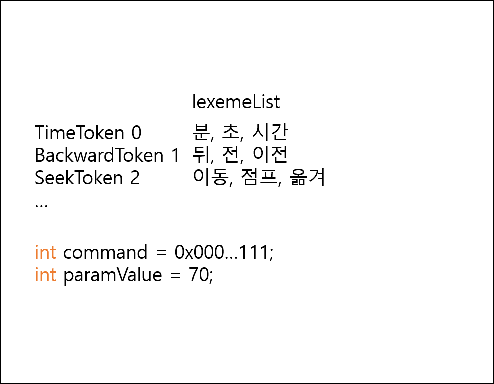
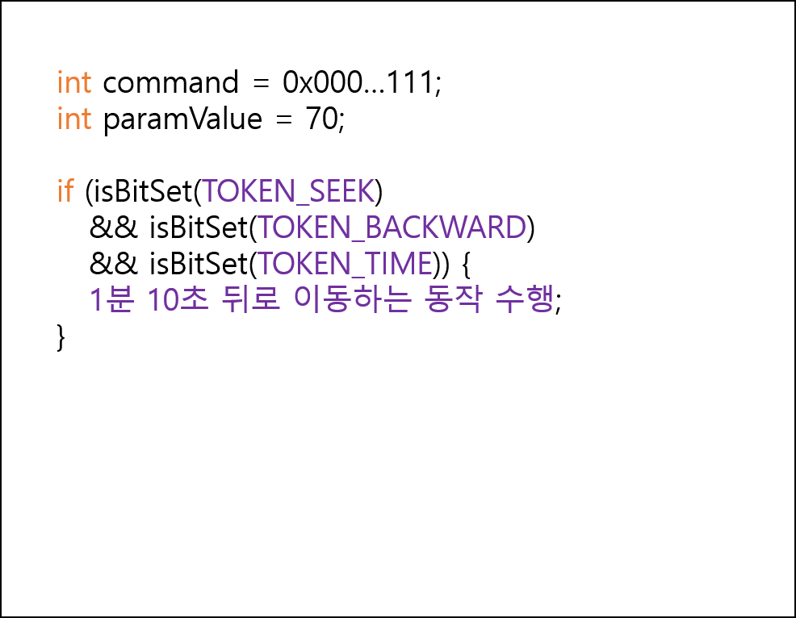

# 음성인식 유튜브 플레이어 - 헬로 쿠키야

**'음성인식 유튜브 플레이어 - 헬로 쿠키야'** 프로젝트는 2020학년도 1학기 인하대학교 컴퓨터공학과 종합설계 과목에서 진행한 캡스톤 프로젝트입니다.

## 개발 동기

평소에 유튜브 요리 영상을 보면서 요리를 하곤 합니다. 어느날 유튜브 요리 영상을 보면서 요리를 하다가, 재료 손질 부분을 놓친적이 있었습니다. 다급하게 유튜브 영상의 플레이 시점을 이동하려 했지만 손에 묻은 물기 때문에 터치가 잘 되지 않았습니다. 이 때 카카오 AI 스피커나 기가 지니 처럼 음성으로 유튜브 영상을 컨트롤 하고 싶다는 생각을 하게 되었습니다. 이 때의 경험을 토대로 **음성인식 유튜브 플레이어** 프로젝트를 진행하게 되었습니다.

<p align="center"></p align="center">

## 어플리케이션 개요

**'음성인식 유튜브 플레이어 - 헬로 쿠키야'** 는 음성으로 유튜브 영상을 컨트롤 하는 어플리케이션입니다. 본 앱은 유튜브를 보면서 요리를 하는 등 양손을 자유롭게 사용하지 못하는 상황에서 음성으로 유튜브를 컨트롤 할 수 있는 인터페이스를 제공합니다.

예를 들어 사용자가 유튜브 요리 영상을 보면서 요리를 따라하고 있는 상황을 가정해봅시다. 영상이 너무 빨리 지나가버려서 아직 재료 손질을 끝내지 못한 경우 **'헬로 쿠키야, 영상 정지'** 와 같은 문장을 발화하여 유튜브 영상을 정지할 수 있습니다. 또한 **'헬로 쿠키야, 영상 재생'** 과 같은 문장을 발화하면 영상을 다시 재생할 수 있습니다.

만약 이전에 봤던 부분을 다시 봐야할 필요가 있을 때는 **'헬로 쿠키야, 몇 초 전으로 이동해줘'** 와 같은 문장을 발화하여 영상의 플레이 시점을 전으로 이동 시킬 수 있습니다.

<p align="center"></p align="center">

여러번 봐야하는 부분은 북마크 기능을 통해서 북마크를 지정할 수 있습니다. **'헬로 쿠키야, 여기에 북마크 생성'** 과 같은 문장을 발화하여 영상의 특정 플레이 시점에 북마크를 지정할 수 있습니다. 이 후 해당 북마크가 설정된 시점으로 이동하고 싶은 경우 **'헬로 쿠키야, 북마크 몇 번으로 이동'** 과 같은 문장을 발화하여 이동할 수 있습니다.

<p align="center"></p align="center">

## 데모영상

<a href="http://www.youtube.com/watch?v=z_fAx0t6cIo" target="_blank">유튜브 데모영상</a>

## APK 파일

<a href="./app-release.apk" target="_blank">apk 파일</a>

## 상세 기능 소개

### 사용자 음성인식 초기화 및 키워드 인식 기능

먼저 소개할 기능은 키워드 인식 기능입니다. 사용자가 ‘헬로 쿠키야’ 라고 발화하면 앱이 이를 인식하여 음성인식 기능을 시작합니다. 사용자가 키워드 인식 기능을 사용하려면 먼저 사용자 음성인식 초기화 과정을 거쳐야 합니다. 이 과정은 앱이 설치되고 난 후 처음 실행되는시점에서 진행됩니다. 또한 사용자 음성인식 초기화를 다시 진행하고 싶은 경우 앱 메뉴에서 사용자 음성인식 초기화 버튼을 눌러 초기화를 진행할 수도 있습니다.

<p align="center"></p align="center">

<p align="center"></p align="center">

사용자 음성인식 초기화 과정이 시작된 경우 위에서 표시한 화면들이 나타납니다. 그림 2에서는 사용자 음성인식에 도움이 될 수 있는 정보(성별, 나이대)를 입력합니다. 그림 3에서는 사용자에게 ‘헬로 쿠키야’ 라는 단어를 3번 녹음하게 합니다. 그림 4에서는 사용자가 시작하기 버튼을 눌러서 사용자 음성인식 초기화를 진행합니다. 이때 SNOWBOY api 서버에 사용자 정보와 녹음된 데이터를 전송하고, 개인 키워드 인식에 필요한 파일을 다운로드 받습니다. 그림
5는 초기화 과정이 모두 끝난 경우 나타납니다.

초기화 과정이 끝난 후에는 앱이 실행되고 있는 시점에서 사용자가 ‘헬로 쿠키야’라고 발화하면 음성인식 기능이 시작되고, 그림 6과 같이 음성인식 명령어 프롬프트 화면이 등장합니다.

<p align="center"></p align="center">

음성인식 프롬프트 화면이 등장한 이 후에 명령어를 발화해서 애플리케이션을 동작시킬 수 있습니다. 사용자가 발화하는 내용은 그림 7 처럼 중간 중간 인식되어 화면에 표시되며 사용자에게 피드백을 제공합니다.

### 음성으로 영상을 정지하고 재생하는 기능

본 앱은 음성을 통해서 영상을 정지하고 재생할 수 있습니다. 예를 들어 사용자가 유튜브 요리 영상을 보면서 요리를 따라하고 있는 상황을 가정해봅시다. 요리 영상의 재료 손질 부분이 너무 빨리 지나가버린 경우, 재료 손질을 모두 끝내기 위해서 음성으로 영상을 정지시켜두고, 재료 손질을 마무리한 다음 영상을 다시 볼 준비가 되었을 때 음성으로 영상을 재생하는 것이 가능해집니다.

<p align="center"></p align="center">

<p align="center"></p align="center">

### 음성으로 영상의 플레이 시점을 조절하는 기능

이 기능은 음성을 통해서 유튜브 영상의 플레이 시점을 조절(Seek) 할 수 있는 기능입니다.

<p align="center"></p align="center">
<p align="center"></p align="center">

사용자가 요리를 하다가 놓친 부분이 있을 때 **‘헬로 쿠키야, 10초 전으로 이동’** 과 같은 문장을 발화하여 영상을 특정 시간 간격만큼 이전으로 이동시키거나, **‘헬로 쿠키야, 1분 앞으로 이동’** 과 같은 문장을 발화하여 이후로 이동시킬 수 있다. 또는 **‘헬로 쿠키야, 2분 10초로 이동’** 과 같은 문장을 발화하여 2분 10초 처럼 해당 시점으로 곧바로 이동시킬 수 있습니다.

### 음성으로 영상에 북마크를 설정하고 북마크가 설정된 시간대로 이동하는 기능

이 기능은 유튜브 영상에서 자주 봐야하거나, 나중에 다시 영상을 재생시켜 시청하는 경우에도 다시 찾아서 보고 싶은 부분을 표시해두는 기능입니다. 사용자가 **‘헬로 쿠키야, 여기에 북마크 생성’** 과 같은 명령을 하고, 북마크 이름을 말하면 해당 플레이 시점에 북마크를 생성합니다. 북마크가 설정된 시간대로 이동하고 싶다면 북마크에 설정된 번호를 이용해서 **‘헬로쿠키야, 북마크 1번으로 이동’** 과 같은 문장을 발화하여 플레이 시점을 이동시킬 수 있습니다.

<p align="center"></p align="center">
<p align="center"></p align="center">

### 사용자가 시청할 유튜브 영상을 애플리케이션 내부로 저장하는 기능

사용자가 음성으로 영상을 컨트롤 하려면 일단 유튜브 영상을 애플리케이션 내부로 저장해야 합니다.

<p align="center"></p align="center">

앱에 저장되어 있는 유튜브 영상이 없는 경우 그림 23 과 같은 화면이 나타나며 하단의 플러스(+) 버튼을 눌러 유튜브를 실행할 수 있습니다. 사용자는 유튜브에서 음성으로 컨트롤 하고 싶은 영상을 찾은 다음 공유 버튼을 누르고, 그림 25에서 나타난 것처럼 공유 리스트에 등장한 ‘헬로 쿠키야’ 앱 아이콘을 눌러서 유튜브 영상을 앱 내부로 저장합니다.

<p align="center"></p align="center">

공유하기 버튼을 누른 이 후에는 본 앱이 실행되며, 앱을 내부로 저장할 때 영상의 제목과 설명을 수정할 수 있는 화면이 나타납니다. 이 후 그림 27 에서 처럼 저장될 영상의 모습을 확인하고 저장 버튼을 눌러 영상을 앱 내부로 저장할 수 있습니다.

### 나머지 기능들

#### 다음 영상, 이전 영상 재생
사용자가 ‘헬로 쿠키야, 다음 영상 재생’ 과 같은 문장을 발화하여 다음 영상을 재생시킬수 있고, ‘헬로 쿠키야, 이전 영상 재생’ 과 같은 문장을 발화하여 이전 영상을 재생시킬 수 있습니다.

#### 목록으로 이동하기 기능
사용자가 ‘헬로 쿠키야, 목록으로’ 와 같은 문장을 발화하여 영상이 저장되어 있는 목록으로 이동할 수 있습니다. 

#### 자동 스크롤 기능

목록에 저장되어 있는 영상이 너무 많거나, 영상 재생화면에 저장되어 있는 북마크가 많아서 전체 내용이 화면에 모두 나타나지 않은 경우 ‘헬로 쿠키야, 자동 스크롤’ 과 같은 문장을 발화하여 화면을 자동 스크롤 시킬 수 있습니다. 이 기능을 이용해서 손으로 스크롤 하지 않고도 화면 전체의 내용을 확인할 수 있습니다.

#### 영상 재생화면 크기를 변경하는 기능

영상 재생화면에서 유튜브 영상을 전체화면으로 바꾸고 싶은 경우 ‘헬로 쿠키야, 전체화면으로’와 같은 문장을 발화하여 전체화면으로 바꿀 수 있습니다. 또한 ‘헬로 쿠키야, 전체화면 종료’와 같은 문장을 발화하여 다시 원래 화면으로 바꿀 수 있습니다.

#### 프로그램 종료 기능

‘헬로 쿠키야, 프로그램 종료’ 와 같은 문장을 발화하여 프로그램을 종료시킬 수 있습니다.

## 명령어 리스트

본 앱(‘헬로 쿠키야’) 의 음성인식 기능 실행을 위한 명령어 문장들은 아래와 같습니다.

**음성 인식 기능 시작 트리거 단어 : ‘헬로 쿠키야’**

**번호가 부여된 영상 재생**
- 헬로 쿠키야, 몇 번 영상 재생
- 헬로 쿠키야, 영상 몇 번 재생
- 헬로 쿠키야, 숫자 몇 번 영상 재생
  
**영상 재생**
- 헬로 쿠키야, 재생
  
**영상 정지**
- 헬로 쿠키야, 정지

**영상 특정 시간 간격만큼 앞으로 이동**
- 헬로 쿠키야, 몇 분 몇 초 앞으로 이동

**영상 특정 시간 간격만큼 전으로 이동**
- 헬로 쿠키야, 몇 분 전으로 이동
- 헬로 쿠키야, 몇 분 뒤로 이동

**영상 특정 시간대로 이동**
- 헬로 쿠키야, 몇 분 몇 초로 이동

**북마크 설정 기능**
- 헬로 쿠키야, 여기에 북마크 생성
- 헬로 쿠키야, 북마크 생성

**북마크로 이동하는 기능**
- 헬로 쿠키야, 북마크 몇 번으로 이동
- 헬로 쿠키야, 몇 번 북마크로 이동
- 헬로 쿠키야, 숫자 몇 번 북마크로 이동

**북마크 삭제 기능**
- 헬로 쿠키야, 북마크 몇 번 삭제
- 헬로 쿠키야, 몇 번 북마크 삭제
- 헬로 쿠키야, 숫자 몇 번 북마크 삭제

**영상 재생화면 전체화면으로 변경**
- 헬로 쿠키야, 전체화면으로

**영상 재생화면 원래대로 변경**
- 헬로 쿠키야, 전체화면 종료

**다음 영상 재생 기능**
- 헬로 쿠키야, 다음 영상 재생

**이전 영상 재생 기능**
- 헬로 쿠키야, 이전 영상 재생

**목록으로 이동하기 기능**
- 헬로 쿠키야, 목록으로

**자동 스크롤 시작, 정지 기능**
- 헬로 쿠키야, 자동스크롤
- 헬로 쿠키야, 자동스크롤 정지

**프로그램 종료 기능**
- 헬로 쿠키야, 프로그램 종료

## 시스템 개요

### 사용한 API

- **YouTube Data api** : 사용자가 재생하기를 원하는 영상의 제목과 설명을 가지고 오기 위해 사용했습니다.
- **YouTube Android Player api** : 유튜브 영상을 외부 애플리키에션에서 재생할 수 있게 해주고, 유튜브 영상을 프로그래밍적으로 조작할 수 있는 여러가지 api를 제공합니다. YouTubePlayerFragment 를 통해서 유튜브 영상 재생화면을 구성했습니다.
- **SNOWBOY Hotword Detection api** : '오케이 구글', '헤이 카카오' 와 같은 짧은 키워드를 인식하는 api 입니다. '헬로 쿠키야'라는 저희 앱 만의 키워드를 인식할 수 있도록 사용했습니다.
- **Google STT (Speech-To-Text) api** : 음성 데이터를 문자열 데이터로 변환해주는 api 입니다. 사용자가 음성으로 발화한 문장을 텍스트로 변환받기 위해 사용했습니다.

### 키워드 인식


**Google STT** 는 사용자의 목소리를 녹음해서 구글 STT 서버에 전송한 다음, 서버에서 해당 녹음파일을 문자열로 변환하여 다시 전송받은 형태입니다. 네트워킹 작업이 필요한만큼 부하가 크다고 생각했습니다. 최신 안드로이드 기기에서는 오프라인시에도 STT 기능이 가능하다고 알고 있지만 역시 계속해서 STT 기능을 수행하는 것은 비효율적이라고 생각했습니다. 또한 사용자가 발화한 모든 문장을 체크한다면 발화된 문장이 명령어를 말한 것인지 아닌지를 체크해야하는 복잡성이 추가된다고 생각했습니다.

따라서 **Google STT** 를 이용하여 계속해서 음성인식을 수행하여 사용자가 어떤 명령어를 발화하는지 체크하는것 보다, 먼저 간단한 키워드 인식 기능을 이용해서 키워드가 인식되었는지 체크한 다음, 키워드가 인식된 경우에만 STT를 수행하는 것이 효율적이라고 생각했습니다.

저희 앱에서는 **'헬로 쿠키야'** 라는 키워드를 인식하는 기능을 위해서 위 그림의 오른쪽에 나타난 것처럼 `RecordingThread` 라는 클래스를 구성했습니다. 이 클래스 객체 내부에서는 쓰레드를 생성하여 관리하는데, 해당 쓰레드에서는 매 순간 디바이스로 들어오는 음성 데이터를 `audioBuffer` 라는 곳에 녹음합니다. 그 다음 SNOWBOY api 에서 제공되는 `SnowboyDetect` 클래스 객체의 `runDetection` 메소드를 통해서 `audioBuffer` 에 녹음된 데이터가 키워드인지를 판단합니다. 판단 결과는 `runDetection` 메소드의 반환값으로 나타나며 이 값이 양수인 경우 키워드가 인식되었다는 의미입니다. **(1) 이런 경우 `handler` 객체를 이용해서 `MainThread`의 `MessageQueue`에 키워드 인식과 관련된 메시지를 전송합니다.**

`MainThread` 에서는 `MessageQueue` 에 키워드 인식과 관련된 메시지가 들어오면 `handleMessage` 라는 콜백 메소드를 호출합니다. **(2) 이 메소드 안에서 처리하고 있는 메시지가 키워드 인식과 관련된 내용이라면 `RecordingThread` 객체 내부의 쓰레드가 수행하고 있던 키워드 인식 동작의 무한루프 탈출조건을 설정하고 키워드 인식 기능을 중지합니다.**

**(3) `RecordingThread` 객체 내부 쓰레드가 키워드 인식과 관련된 무한루프에서 탈출하면 녹음 중지와 관련된 메시지를 `MessageQueue`에 전송합니다.**

**(4) `MainThread` 의 `MessageQueue` 에 녹음 중지와 관련된 메시지가 들어오면 최종적으로 STT 기능을 수행하여 사용자가 발화하는 명령어를 해석하기 시작합니다.**

위에서 설명한 것처럼 일단 키워드 인식 기능을 중단하고 음성인식 기능을 수행하는 이유는 **안드로이드 기기의 마이크라는 공유자원을 여러 쓰레드에서 동시에 접근하는 과정에서 발생할 수 있는 문제를 회피하기 위해서입니다.** 음성인식 기능이 끝나고 난 뒤에는 `RecordingThread` 객체 내부 쓰레드가 다시 키워드 인식과 관련된 무한루프 코드를 수행하게 합니다.

<a href="https://github.com/ChanJun-Park/HelloCookieYa/blob/master/hello_cookieya/app/src/main/java/ai/kitt/snowboy/audio/RecordingThread.java" target="_blank">`RecordingThread.java` 관련 코드</a>

```java
...
public class RecordingThread {

    private Handler handler;    // 키워드를 인식한 경우 또는 녹음이 중지된 경우 메시지를 전달받을 액티비티의 핸들러
    private Thread thread;      // 사운드를 녹음하며 키워드를 인식할 쓰레드의 참조변수

    private boolean shouldThreadContinueRunning; // 스레드가 계속 실행되어야 하는지 체크하는 플래그
    private boolean shouldContinueRecording;     // 사운드 녹음이 계속 실행되어야 하는지 체크하는 플래그
    private boolean isAudioRecordStarted;        // 녹음 시작시 AudioRecorder 객체의 start 메소드를 한번만
                                                 // 호출하게 하는 플래그

    // 키워드 인식 기능을 수행하는 클래스
    private SnowboyDetect detector;

    ...

    private void sendMessage(MsgEnum what, Object obj) {
        if (null != handler) {
            Message msg = handler.obtainMessage(what.ordinal(), obj);
            handler.sendMessage(msg);
        }
    }

    // 기기로 들어오는 사운드를 녹음하고, 키워드 인식 수행할 쓰레드 생성
    // 해당 쓰레드에서 record() 메소드에 정의한 코드를 실행
    public void initThread() {
        shouldThreadContinueRunning = true;
        if (thread != null)
            return;
        thread = new Thread(new Runnable() {
            @Override
            public void run() {
                record();
            }
        });
        thread.start();
    }

    public void startRecording() {
        detector.setSensitivity("0.5");
        detector.applyFrontend(true);

        initThread();

        // 무한루프 수행조건 설정
        shouldContinueRecording = true;
    }

    public void stopRecording() {

        // 무한루프 탈출조건 설정
        shouldContinueRecording = false;
    }

    ...

    // 키워드 인식 기능 수행 코드
    private void record() {
        android.os.Process.setThreadPriority(android.os.Process.THREAD_PRIORITY_AUDIO);

        // Buffer size in bytes: for 0.1 second of audio
        int bufferSize = (int) (Constants.SAMPLE_RATE * 0.1 * 2);
        byte[] audioBuffer = new byte[bufferSize];

        AudioRecord record = new AudioRecord(
                MediaRecorder.AudioSource.DEFAULT,
                Constants.SAMPLE_RATE,
                AudioFormat.CHANNEL_IN_MONO,
                AudioFormat.ENCODING_PCM_16BIT,
                bufferSize);

        if (record.getState() != AudioRecord.STATE_INITIALIZED) {
            Timber.e("Audio Record can't initialize!");
            return;
        }

        while(shouldThreadContinueRunning) {

            while (shouldContinueRecording) {

                if (!isAudioRecordStarted) {
                    isAudioRecordStarted = true;
                    record.startRecording();
                }

                // 기기로 들어오는 사운드 녹음
                if (android.os.Build.VERSION.SDK_INT >= 23)
                    record.read(audioBuffer, 0, audioBuffer.length, AudioRecord.READ_BLOCKING);
                else
                    record.read(audioBuffer, 0, audioBuffer.length);

                // Converts to short array.
                short[] audioData = new short[audioBuffer.length / 2];
                ByteBuffer.wrap(audioBuffer).order(ByteOrder.LITTLE_ENDIAN).asShortBuffer().get(audioData);

                // 키워드가 발화되었는지 체크
                int result = detector.runDetection(audioData, audioData.length);
                if (result == -1) {
                    sendMessage(MsgEnum.MSG_ERROR, "Unknown Detection Error");
                } else if (result > 0) {
                    // 키워드가 인식된 경우
                    sendMessage(MsgEnum.MSG_ACTIVE, null);
                }
            } // while (shouldContinueRecording) 끝

            // STT 기능 수행을 위해서 키워드 인식을 위한 음성 녹음은 중지
            if (isAudioRecordStarted) {
                record.stop();
                isAudioRecordStarted = false;
                sendMessage(MsgEnum.MSG_RECORD_STOP, null);
            }
        } // while(shouldThreadContinueRunning) 끝

        record.release();
    }
}
```

<a href="https://github.com/ChanJun-Park/HelloCookieYa/blob/master/hello_cookieya/app/src/main/java/edu/inha/hellocookieya/HelloCookieYaActivity.java" taget="_blank">`HelloCookieYaActivity.java` 관련 코드</a>

```java
public abstract class HelloCookieYaActivity extends AppCompatActivity {

    // 키워드 인식 쓰레드에서 전달받은 메시지를 처리할 핸들러
    protected RecordingThreadMessageHandler handler = new RecordingThreadMessageHandler(this);

    // 키워드 인식 기능을 수행하는 쓰레드를 관리하는 클래스 멤버 객체
    protected RecordingThread recordingThread;

    // 키워드 인식 쓰레드가 종료되었을때, 키워드 인식에 의한 종료인지
    // 어플리케이션 종료에 의한 종료인지를 체크하는 변수
    private boolean isKeywordDetected = false;

    ...

    @Override
    protected void onCreate(@Nullable Bundle savedInstanceState) {
        super.onCreate(savedInstanceState);

        initHotword();
    }

    protected void initHotword() {
        // External Storage 쓰기 권한, 마이크 녹음 권한
        if (ActivityCompat.checkSelfPermission(this, Manifest.permission.WRITE_EXTERNAL_STORAGE) == PackageManager.PERMISSION_GRANTED
                && ActivityCompat.checkSelfPermission(this, Manifest.permission.RECORD_AUDIO) == PackageManager.PERMISSION_GRANTED) {

            // 사용자 키워드 인식 초기화 확인
            if (checkForPmdl() && checkVoiceInitialized()) {
                // RecordingThread 객체에 키워드 인식과 관련된 
                // 메시지를 전달받을 Handler 객체 전달
                recordingThread = RecordingThread.getInstance(handler);
                recordingThread.initThread();
            }
        }
    }
    ...

    // RecordingThread 객체에 키워드 인식과 관련된 
    // 메시지를 전달받아서 처리할 Handler 클래스 정의
    static class RecordingThreadMessageHandler extends Handler {
        private final WeakReference<HelloCookieYaActivity> helloCookieYaActivityWeakReference;

        RecordingThreadMessageHandler(HelloCookieYaActivity activity) {
            helloCookieYaActivityWeakReference = new WeakReference<>(activity);
        }

        @Override
        public void handleMessage(@NonNull Message msg) {
            MsgEnum message = MsgEnum.getMsgEnum(msg.what);
            HelloCookieYaActivity activity = helloCookieYaActivityWeakReference.get();

            switch (message) {
                // 키워드가 감지된 경우
                case MSG_ACTIVE:
                    activity.isKeywordDetected = true;

                    // STT 기능 수행전 키워드 인식 쓰레드에서의 녹음은 중지시키기
                    activity.recordingThread.stopRecording();
                    break;
                case MSG_ERROR:
                    break;
                // 키워드 인식 쓰레드의 사운드 녹음이 중지된 경우
                case MSG_RECORD_STOP:
                    // 액티비티의 onPause() 호출에 의해서가 아닌,
                    // 키워드가 인식되어서 녹음이 중지된 경우만 체크
                    if (activity.isKeywordDetected) {
                        activity.isKeywordDetected = false;

                        // STT 및 음성 명령어 파싱 액티비티 실행
                        Intent intent = new Intent(activity.getApplicationContext(), SpeechRecognitionActivity.class);
                        intent.putExtra("promptMessage", "멍멍(무엇을 도와드릴까요?)");
                        activity.startActivityForResult(intent, REQUEST_SPEECH_RECOGNITION);
                    }
                    ...
                    break;
                default:
                    super.handleMessage(msg);
                    break;
            }
        }
    }
}
```

### 음성 명령어 파싱

다음으로 구글 STT를 통해서 문자열로 변환한 사용자의 명령을 어떻게 해석하고, 어떻게 관련 동작을 수행하게 했는지 설명하겠습니다. 예를 들어, 사용자가 '1분 10초 뒤로 이동해줘' 와 같은 명령을 했을 때, 발화한 명령이 어떤 것인지를 알 수 있게 하는 주요한 단어들이 있습니다. 시간의 양을 나타내는 **'1분 10초'** 라던지, 뒤쪽을 의미하는 **'뒤'** 라던지, 플레이 시점을 이동하라는 **'이동'** 이라는 단어가 바로 그것입니다. 이렇게 명령어를 해석하는데 중요한 단어들을 정의하고 구분하기 위해서 여러 개의 **TokenInfo 클래스**를 구현하였습니다.

<a href="https://github.com/ChanJun-Park/HelloCookieYa/tree/master/hello_cookieya/app/src/main/java/edu/inha/hellocookieya/speech/command/token" target="_blank">다양한 TokenInfo 클래스가 정의되어 있는 token 패키지 링크</a>

<a href="https://github.com/ChanJun-Park/HelloCookieYa/blob/master/hello_cookieya/app/src/main/java/edu/inha/hellocookieya/speech/command/token/PlayTokenInfo.java" target="_blank">**영상 재생과 관련된 PlayTokenInfo 클래스**</a>

```java
public class PlayTokenInfo extends TokenInfo {

    private static ArrayList<String> lexemeList;

    private static PlayTokenInfo instance;

    private PlayTokenInfo() {
        //TODO : DB와 연동해서 lexemeList 초기화하기
        lexemeList = new ArrayList<>();
        lexemeList.add("재생");
        lexemeList.add("플레이");
        lexemeList.add("시작");
        lexemeList.add("틀어줘");
        lexemeList.add("틀어 줘");
        lexemeList.add("보여줘");
        lexemeList.add("보여 줘");
    }

    public static PlayTokenInfo getInstance() {
        if (instance == null) instance = new PlayTokenInfo();
        return instance;
    }

    @Override
    public Token getToken(String str) {
        return new Token(TOKEN_PLAY);
    }

    @Override
    public boolean check(String str) {
        if (lexemeList != null) {
            for (String lexeme : lexemeList) {
                if (str.contains(lexeme)) return true;
            }
        } else {
            Timber.e("PlayTokenInfo 의 lexemeList 가 비었음");
        }
        return false;
    }
}
```

**`TokenInfo`** 클래스는 다음과 같은 구성요소로 이루어져 있습니다.

- **`lexemeList`** : 각각의 `TokenInfo` 클래스는 해당 토큰이 될 수 있는 후보 단어들을 **lexemeList**라는 클래스 멤버 변수로 관리합니다.
- **`check(String str)`** : 주어진 문자열이 해당 토큰으로 해석될 수 있는지를 판단하는 메소드. **lexemeList** 를 순회하여 주어진 문자열에 **lexemeList** 의 단어가 포함되어 있는지 체크합니다.
- **`getToken(String str)`** : 실제 토큰을 생성해서 반환해주는 메소드. 생성된 토큰에는 어떤 토큰인지에 대한 정보와 추후에 사용할 수 있는 인자값을 저장하고 있습니다.

실제로 사용자가 발화한 문장을 해석하는 클래스는 `CommandParser` 클래스입니다.

<a href="https://github.com/ChanJun-Park/HelloCookieYa/blob/master/hello_cookieya/app/src/main/java/edu/inha/hellocookieya/speech/command/CommandParser.java" target="_blank">**CommandParser 클래스**</a>

```java
public class CommandParser {
    private static ArrayList<TokenInfo> tokenInfoItems;
    private static CommandParser instance;

    private CommandParser() {
        tokenInfoItems = new ArrayList<>();
        tokenInfoItems.add(PlayTokenInfo.getInstance());
        tokenInfoItems.add(PauseTokenInfo.getInstance());
        tokenInfoItems.add(SeekTokenInfo.getInstance());
        tokenInfoItems.add(CreateTokenInfo.getInstance());
        tokenInfoItems.add(BookmarkTokenInfo.getInstance());
        tokenInfoItems.add(VideoTokenInfo.getInstance());
        tokenInfoItems.add(NextTokenInfo.getInstance());
        tokenInfoItems.add(PreviousTokenInfo.getInstance());
        tokenInfoItems.add(ListTokenInfo.getInstance());
        tokenInfoItems.add(QuitTokenInfo.getInstance());
        tokenInfoItems.add(NumberTokenInfo.getInstance());
        tokenInfoItems.add(TimeTokenInfo.getInstance());
        tokenInfoItems.add(ForwardTokenInfo.getInstance());
        tokenInfoItems.add(BackwardTokenInfo.getInstance());
        tokenInfoItems.add(ScrollTokenInfo.getInstance());
        tokenInfoItems.add(AutoTokenInfo.getInstance());
        tokenInfoItems.add(DeleteTokenInfo.getInstance());
        tokenInfoItems.add(LandscapeTokenInfo.getInstance());
        tokenInfoItems.add(PortraitTokenInfo.getInstance());
        tokenInfoItems.add(ScreenTokenInfo.getInstance());
    }

    public static CommandParser getInstance() {
        if (instance == null) instance = new CommandParser();
        return instance;
    }

    private Token parseToken(String strToken) {
        Token resultToken = null;
        for (TokenInfo info : tokenInfoItems) {
            if (info.check(strToken)) {
                resultToken = info.getToken(strToken);
                break;
            }
        }
        return resultToken;
    }

    public Command parseCommand(String str) {
        int command = 0;
        int paramValue = 0;

        StringTokenizer tokenizer = new StringTokenizer(str);
        while(tokenizer.hasMoreTokens()) {
            String strToken = tokenizer.nextToken();
            Timber.d("문자열 토큰 : %s", strToken);
            Token token = parseToken(strToken);
            if (token != null) {
                command |= token.getType();
                Timber.d("토큰 타입 : %s", token.getType());
                if (token.getValue() != Token.N_A) {
                    paramValue += token.getValue();
                }
            } else {
                Timber.d("파싱되지 못한 토큰 : %s", strToken);
            }
        }

        Timber.d("최종 파싱된 command 값 : %s", command);
        return new Command(command, paramValue);
    }

}
```

**`CommandParser`** 클래스는 다음과 같은 구성요소로 이루어져 있습니다.

- **`tokenInfoItems`** : 앱에서 사용하는 모든 토큰에 대한 정보를 `tokenInfoItems` 라는 **ArrayList** 로 관리합니다.
- **`parseCommand(String str)`** : 사용자의 명령어를 해석하는 메소드입니다. 
- **`parseToken(String strToken)`** : 추출된 한 단어가 어떤 토큰인지를 체크하고 해당 토큰을 반환하는 메소드입니다.
  
**`parseCommand(String str)`** 메소드 내부에서는 우선 해석한 명령어 결과를 담을 정수 변수 **`command`** 와 명령어에 필요한 인자를 담을 **`paramValue`** 를 선언하였습니다. 그 다음 사용자 발화 명령어 문장에 포함된 단어를 하나씩 추출하여 해당 단어가 어떤 토큰인지를 **`parseToken(strToken)`** 메소드를 통해 파악하고 토큰 객체를 반환받습니다. 그 다음 **`command`** 변수에는 해당 토큰에 대해서 미리 약속된 위치의 비트에 1을 세팅하고, **1분** 과 같은 토큰에서 명령어의 파라미터로 쓰일 **1** 을 추출하여 **`paramValue`** 에 저장해둡니다.

사용자 발화 명령어에 포함된 모든 단어들에 대해서 위와 같은 동작을 반복하여 계산한 **command** 와 **paramValue** 값을 최종적으로 **`Command`** 라는 클래스로 Wrapping 하여 반환합니다.

**`Command`** 클래스는 다음과 같이 정의되어 있습니다.

<a href="https://github.com/ChanJun-Park/HelloCookieYa/blob/master/hello_cookieya/app/src/main/java/edu/inha/hellocookieya/speech/command/Command.java" target="_blank">**Command 클래스**</a>

```java
public class Command implements Parcelable {
    private int command = 0;
    private int paramValue = 0;

    public Command() {}

    public Command(int command) {
        this.command = command;
    }

    public Command(int command, int paramValue) {
        this.command = command;
        this.paramValue = paramValue;
    }

    ...

    public int getCommand() {
        return command;
    }

    public int getParamValue() {
        return paramValue;
    }

    public CommandEnum getCmdType() {
        CommandEnum cmdType;

        // 조건 3개
        if (isCommandBitSet(TokenInfo.TOKEN_PLAY) && isCommandBitSet(TokenInfo.TOKEN_VIDEO)
                && isCommandBitSet(TokenInfo.TOKEN_NUMBER)) {
            cmdType = CommandEnum.COMMAND_PLAY_NTH_VIDEO;
        } else if (isCommandBitSet(TokenInfo.TOKEN_DELETE) && isCommandBitSet(TokenInfo.TOKEN_VIDEO)
                && isCommandBitSet(TokenInfo.TOKEN_NUMBER)) {
            cmdType = CommandEnum.COMMAND_DELETE_NTH_VIDEO;
        } else if (isCommandBitSet(TokenInfo.TOKEN_DELETE) && isCommandBitSet(TokenInfo.TOKEN_BOOKMARK)
                && isCommandBitSet(TokenInfo.TOKEN_NUMBER)) {
            cmdType = CommandEnum.COMMAND_DELETE_NTH_BOOKMARK;
        } else if (isCommandBitSet(TokenInfo.TOKEN_SEEK) && isCommandBitSet(TokenInfo.TOKEN_FORWARD)
                && isCommandBitSet(TokenInfo.TOKEN_TIME)) {
            cmdType = CommandEnum.COMMAND_RELATIVE_SEEK;
        } else if (isCommandBitSet(TokenInfo.TOKEN_SEEK) && isCommandBitSet(TokenInfo.TOKEN_BACKWARD)
                && isCommandBitSet(TokenInfo.TOKEN_TIME)) {
            cmdType = CommandEnum.COMMAND_RELATIVE_SEEK;
            paramValue *= -1;
        } else if (isCommandBitSet(TokenInfo.TOKEN_BOOKMARK) && isCommandBitSet(TokenInfo.TOKEN_SEEK)
                && isCommandBitSet(TokenInfo.TOKEN_NUMBER)) {
            cmdType = CommandEnum.COMMAND_SEEK_TO_BOOKMARK;
        } else if (isCommandBitSet(TokenInfo.TOKEN_AUTO) && isCommandBitSet(TokenInfo.TOKEN_SCROLL)
                && isCommandBitSet(TokenInfo.TOKEN_PAUSE)) {
            cmdType = CommandEnum.COMMAND_AUTO_SCROLL_STOP;
        } else if (isCommandBitSet(TokenInfo.TOKEN_LANDSCAPE) && isCommandBitSet(TokenInfo.TOKEN_SCREEN)
                && isCommandBitSet(TokenInfo.TOKEN_QUIT)) {
            cmdType = CommandEnum.COMMAND_PORTRAIT_MODE;
        // 조건 2개
        } else if (isCommandBitSet(TokenInfo.TOKEN_LANDSCAPE) && isCommandBitSet(TokenInfo.TOKEN_SCREEN)) {
            cmdType = CommandEnum.COMMAND_LANDSCAPE_MODE;
        } else if (isCommandBitSet(TokenInfo.TOKEN_PORTRAIT) && isCommandBitSet(TokenInfo.TOKEN_SCREEN)) {
            cmdType = CommandEnum.COMMAND_PORTRAIT_MODE;
        }
        else if (isCommandBitSet(TokenInfo.TOKEN_PLAY) && isCommandBitSet(TokenInfo.TOKEN_NEXT)) {
            cmdType = CommandEnum.COMMAND_PLAY_NEXT_VIDEO;
        } else if (isCommandBitSet(TokenInfo.TOKEN_PLAY) && isCommandBitSet(TokenInfo.TOKEN_PREVIOUS)) {
            cmdType = CommandEnum.COMMAND_PLAY_PREV_VIDEO;
        } else if (isCommandBitSet(TokenInfo.TOKEN_PLAY) && isCommandBitSet(TokenInfo.TOKEN_TIME)) {
            cmdType = CommandEnum.COMMAND_SEEK;
        } else if (isCommandBitSet(TokenInfo.TOKEN_SEEK) && isCommandBitSet(TokenInfo.TOKEN_TIME)) {
            cmdType = CommandEnum.COMMAND_SEEK;
        } else if (isCommandBitSet(TokenInfo.TOKEN_CREATE) && isCommandBitSet(TokenInfo.TOKEN_BOOKMARK)) {
            cmdType = CommandEnum.COMMAND_CREATE_BOOKMARK;
        } else if (isCommandBitSet(TokenInfo.TOKEN_AUTO) && isCommandBitSet(TokenInfo.TOKEN_SCROLL)) {
            cmdType = CommandEnum.COMMAND_AUTO_SCROLL;
        // 조건 1
        } else if (isCommandBitSet(TokenInfo.TOKEN_LANDSCAPE)) {
            cmdType = CommandEnum.COMMAND_LANDSCAPE_MODE;
        } else if (isCommandBitSet(TokenInfo.TOKEN_PORTRAIT)) {
            cmdType = CommandEnum.COMMAND_PORTRAIT_MODE;
        } else if (isCommandBitSet(TokenInfo.TOKEN_PLAY)) {
            cmdType = CommandEnum.COMMAND_PLAY;
        } else if (isCommandBitSet(TokenInfo.TOKEN_PAUSE)) {
            cmdType = CommandEnum.COMMAND_PAUSE;
        } else if (isCommandBitSet(TokenInfo.TOKEN_LIST)) {
            cmdType = CommandEnum.COMMAND_MOVE_TO_LIST;
        } else if (isCommandBitSet(TokenInfo.TOKEN_QUIT)) {
            cmdType = CommandEnum.COMMAND_QUIT;
        } else {
            cmdType = CommandEnum.UNDEFINED_COMMAND;
        }
        return cmdType;
    }

    private boolean isCommandBitSet(int tokenInfoType) {
        return (command & tokenInfoType) != 0;
    }
    ...
}
```

**`Command`** 클래스에는 다음과 같은 구성요소들이 있습니다.

- **`getCmdType()`** : **command** 멤버 변수에 설정된 비트들을 확인하여 이 명령이 어떤 명령인지를 알려주는 **`CommandEnum`** 객체를 반환합니다.

**`CommandParser`** 의 **`parseCommand`** 메소드를 호출한 쪽에서는 호출 결과로 반환받은 **`Command`** 객체의 **`getCmdType()`** 메소드를 통해서 사용자가 발화한 문장이 어떤 명령인지를 판단하고 그에 따라 적절한 동작을 수행하게 됩니다.

```java
public class PlayVideoActivity extends HelloCookieYaActivity {
    ...
    @Override
    protected void processReturnedCommand() {
        ...
        if (parsedCommand != null) {
                CommandEnum resultEnum = parsedCommand.getCmdType();
                switch (resultEnum) {
                    ...
                    case COMMAND_PLAY:
                        Toast.makeText(getApplicationContext(), "재생", Toast.LENGTH_LONG).show();
                        player.play();
                        break;
                        ...
                }
        }
        ...
    }
}
```

지금까지 설명한 내용을 그림으로 간략하게 설명하면 다음과 같습니다.

<p align="center"></p align="center">

<p align="center"></p align="center">

Java의 **StringTokenizer** 클래스를 이용해서 명령어 문자열의 단어를 하나씩 추출합니다. 각각의 TokenInfo 클래스의 lexemeList 를 순회하여 lexemeList의 단어가 추출된 단어에 포함되어 있는지 확인합니다. 만약 그렇다면 추출된 단어를 해당 토큰으로 인식합니다. 이제 인식된 토큰에 알맞는 **command 변수의 비트를 세팅**합니다. 각각의 토큰들은 0부터 31사이의 숫자에 대응합니다. 토큰이 인식된 경우 해당 토큰이 가리키는 숫자의 위치에 command 변수의 비트를 1로 세팅합니다.

TimeToken의 경우 해당 토큰이 나타내는 숫자값을 저장해둘 필요가 있습니다. 토큰 내부에 있는 숫자를 읽어들여서 paramValue에 저장해둡니다.

<p align="center"></p align="center">

이런식으로 명령어 문자열의 모든 토큰을 확인하여 command 변수와 paramValue를 갱신해줍니다.

<p align="center"></p align="center">

명령어 문자열 파싱이 완료되면 command 변수에 어떤 비트가 세팅되어 있는지 확인한 다음, 특정 명령어 대응하는 모든 비트가 세팅된 경우 해당 동작을 수행하게 됩니다.

<p align="center"></p align="center">

### 데이터베이스 테이블


본 애플리케이션은 YouTube 영상마다 부여되어 있는 url 링크와 YouTube API를 이용하여
애플리케이션 내부에서 영상을 보여줍니다. 다음은 YouTube 영상의 url 저장 및 관련 기능을 위한 데이터베이스 테이블들에 대한 설명입니다.

- **playlist**
  - 설명 : 사용자가 원하는 기준에 따라 영상을 분류하기 위한 재생목록 데이터를 나타냄
  - **_id** : 재생목록을 구분하는 id. 생성된 순서대로 부여되는 primary key이다.
  - **playlist_name** : 재생목록의 이름
- **link_video**
  - 설명 : 저장된 YouTube 영상에 대한 정보를 나타냄
  - **_id** : 영상에 대한 id. 영상이 저장된 순서대로 1씩 증가하여 지정됨 primary key 속성을 가지고있다.
  - **video_youtube_id** : YouTube 영상에 부여되어 있는 고유한 아이디. link_video 테이블 내에서 한 행을 구분하기 위해 정의된 **_id** 와는 다르며 이 아이디는 유튜브에서 정한다.
  - **title** : 영상의 이름
  - **url** : 영상의 url
  - **description** : 영상의 상세 설명
  - **playlist_id** : 해당 영상이 저장된 재생목록의 id
- **bookmark**
  - 설명 : 사용자가 시청했던 영상의 특정 시점에 부여한 북마크 정보
  - **_id** : 영상의 특정 시점에 설정된 북마크에 대한 아이디. 생성된 순서대로 숫자를 부여받는 primary key 이다.
  - **video_id** : 해당 북마크가 설정된 영상의 아이디. link_video 테이블의 _id를 foreign key 속성으로 갖는다.
  - **location** : 북마크가 설정된 영상의 플레이 시점
  - **description** : 북마크에 대한 설명

외래키 제약조건이 있는 칼럼을 포함하는 테이블에 대해서 테이블이 참조하고 있던 외래키 관련 튜플이 제거되는 경우, 해당 외래키를 참조하는 모든 튜플 또한 ON DELETE CASCADE 되도록 설정하였습니다.

## 프로젝트 결과 및 향후 계획

### ‘헬로 쿠키야’ 키워드 인식

- 영상이 재생되지 않을 때 키워드 인식률 (10/10)
- 영상이 재생되는 경우 키워드 인식률 (10/10)
- 사운드가 꽉 차는 영상 이 재생되는 경우 키워드 인식률 (5/10)
- 10개의 영상 에서 영상 사운드에 잘못 인식한 횟수 : 평균 0.6 회

대체로 만족할만한 성능이지만 시끄러운 음악이 나오는 영상이나 환경에서는 인식률이 떨어집니다. SNOWBOY Hotword Detection api를 이용해서 상업용 앱을 제작할 경우 비용을 지불해야 하기 때문에 향후 실제 서비스를 출시한다면 직접 키워드 인식 기능을 구현할 예정입니다.

### 명령어 파싱 및 동작 수행

- 명령어를 발화하고 대체적으로 1초 이내 적절한 동작 수행
- 구글 STT 기능이 사용자가 발화한 문장을 잘못 번역하는 몇가지 상황(예를 들어 '2번 영상 재생' 이라는 명령을 '이번 영상 재생' 이라는 문장으로 잘못 번역하는 상황)의 예외처리를 구현하지 못했음.

Google STT 로 변환한 문장을 파싱하는 과정이 단순하고 임시방편인 성격이 강합니다. DialogFlow 라는 챗봇 api 를 사용하려 했으나 비교적 단순한 동작을 수행하는 본 앱에는 해당 api 기능이 너무 overkill 하다고 생각하여 도입하지 않았는데, 추후에 더 많은 복잡한 기능을 추가한다면 DialogFlow 도입을 고려할 수 있을 것 같습니다.

